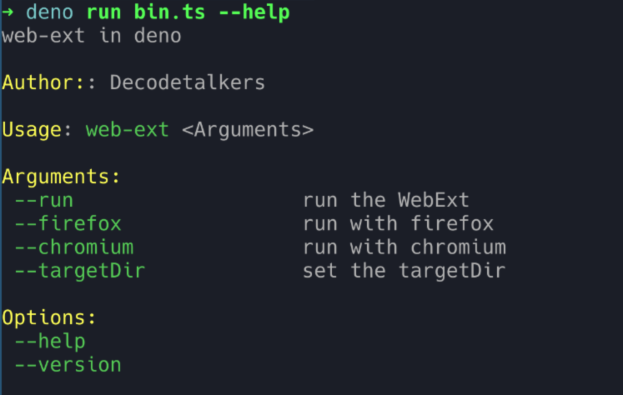

# Deno clap

[](https://jsr.io/@nobody/deno-clap)

This lib try to make a clap for deno.

Yarg is strong, but I do not like that style. I prefer that one of rust, use
derive. So I want to make another one with type systemd of typescript, make it
easier to be matched.

This is a very simple one

## Example

```typescript
import { clapCli, type Command } from "@nobody/deno-clap";

const WebExt = {
  run: {
    description: "run the WebExt",
    default: true,
  },
  firefox: {
    description: "run with firefox",
    children: {
      port: {
        description: "with port",
        type: "number",
        default: 8000,
      },
      devtool: {
        description: "with devtool",
        type: "boolean",
        default: false,
      },
      profile: {
        description: "with profile",
        type: "string",
      },
    },
  },
  chromium: {
    description: "run with chromium",
    children: {
      newDataDir: {
        description: "withNewDataDir",
        type: "boolean",
        default: true,
      },
    },
  },
  targetDir: {
    description: "set the targetDir",
    default: "./",
    type: "string",
  },
} as const;

const cmd: Command = {
  exeName: "web-ext",
  description: "web-ext in deno",
  author: "Decodetalkers",
  version: "0.1.0",
};

// The result is structured, you can auto complete it if you are using denols.
// For example, you can complete some code like `results?.firefox?.description`
const results = clapCli(WebExt, cmd);

console.log(results);
```

## Example


